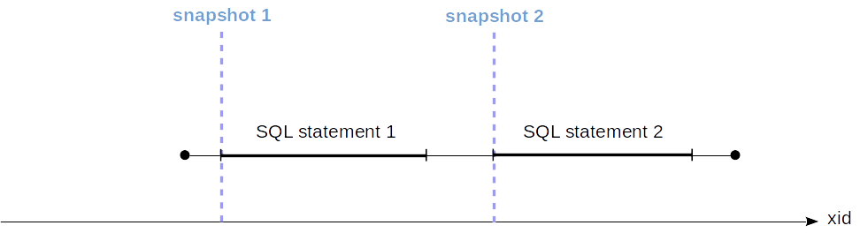
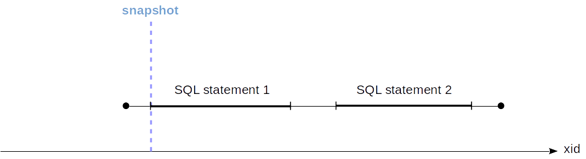
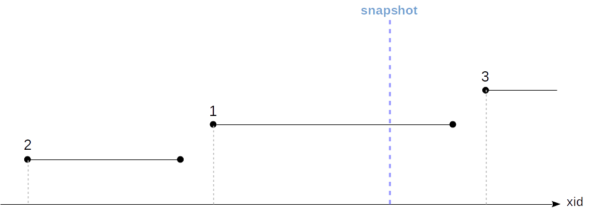
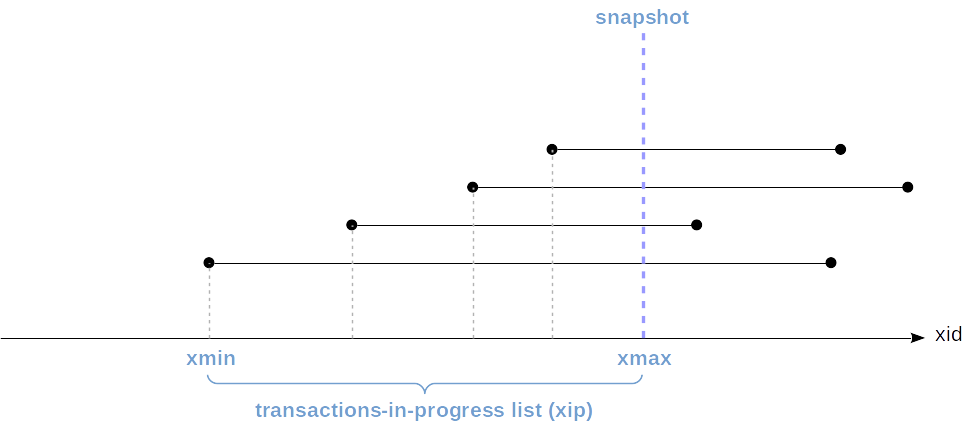
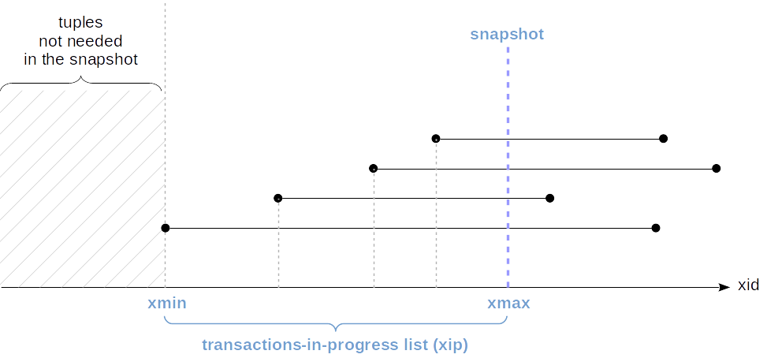
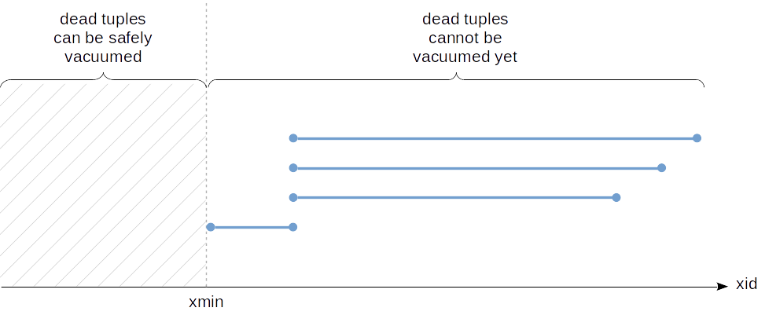

# MVCC in PostgreSQL — 4. Snapshots

> Source: [MVCC in PostgreSQL — 4. Snapshots](https://postgrespro.com/blog/pgsql/5967899)

After having discussed [isolation](./MVCC_in_PostgreSQL_1_Isolation.md) problems and having made a digression regarding the [low-level data structure](https://postgrespro.com/blog/pgsql/5967858), last time we explored [row versions](./MVCC_in_PostgreSQL_3_Row_Versions.md) and observed how different operations changed tuple header fields.

Now we will look at how consistent data snapshots are obtained from tuples.

## What is a data snapshot?

Data pages can physically contain several versions of the same row. But each transaction must see only one (or none) version of each row, so that all of them make up a consistent picture of the data (in the sense of ACID) as of a certain point in time.

Isolation in PosgreSQL is based on snapshots: each transaction works with its own data snapshot, which "contains" data that were committed before the moment the snapshot was created and does not "contain" data that were not committed by that moment yet. We've [already seen](https://postgrespro.com/blog/pgsql/5967856) that although the resulting isolation appears stricter than required by the standard, it still has anomalies.

At the Read Committed isolation level, a snapshot is created at the beginning of each transaction statement. This snapshot is active while the statement is being performed. In the figure, the moment the snapshot was created (which, as we recall, is determined by the transaction ID) is shown in blue.

At the Repeatable Read and Serializable levels, the snapshot is created once, at the beginning of the first transaction statement. Such a snapshot remains active up to the end of the transaction.

## Visibility of tuples in a snapshot

### Visibility rules

A snapshot is certainly not a physical copy of all the necessary tuples. A snapshot is actually specified by several numbers, and the visibility of tuples in a snapshot is determined by rules.

Whether a tuple will be visible or not in a snapshot depends on two fields in the header, namely, `xmin` and `xmax`, that is, the IDs of the transactions that created and deleted the tuple. Intervals like this do not overlap, and therefore, not more than one version represents a row in each snapshot.

The exact visibility rules are pretty complicated and take into account a lot of different cases and extremes.

> You can easily make sure of that by looking into src/backend/utils/time/tqual.c (in version 12, the check moved to src/backend/access/heap/heapam_visibility.c).

To simplify, we can say that a tuple is visible when in the snapshot, changes made by the `xmin` transaction are visible, while those made by the `xmax` transaction are not (in other words, it is already clear that the tuple was created, but it is not yet clear whether it was deleted).

Regarding a transaction, its changes are visible in the snapshot either if it is that very transaction that created the snapshot (it does see its own not yet committed changes) or the transaction was committed before the snapshot was created.

We can graphically represent transactions by segments (from the start time to the commit time):

Here:

*   Changes of the transaction 2 will be visible since it was completed before the snapshot was created.
*   Changes of the transaction 1 will not be visible since it was active at the moment the snapshot was created.
*   Changes of the transaction 3 will not be visible since it started after the snapshot was created (regardless of whether it was completed or not).

Unfortunately, the system is unaware of the commit time of transactions. Only its start time is known (which is determined by the transaction ID and marked with a dashed line in the figures above), but the event of completion is not written anywhere.

All we can do is to find out the _current_ status of transactions at the snapshot creation. This information is available in the shared memory of the server, in the ProcArray structure, which contains the list of all active sessions and their transactions.

But we will be unable to figure out post factum whether or not a certain transaction was active at the moment the snapshot was created. Therefore, a snapshot has to store a list of all the current active transactions.

From the above it follows that in PostgreSQL, it is not possible to create a snapshot that shows consistent data as of certain time backward, _even if_ all the necessary tuples are available in table pages. A question often arises why PostgreSQL lacks retrospective (or temporal; or flashback, like Oracle calls them) queries — and this is one of the reasons.

> Kind of funny is that this functionality was first available, but then deleted from the DBMS. You can read about this in the [article by Joseph M. Hellerstein](https://arxiv.org/pdf/1901.01973.pdf).

So, the snapshot is determined by several parameters:

*   The moment the snapshot was created, more exactly, the ID of the next transaction, yet unavailable in the system (`snapshot.xmax`).
*   The list of active (in progress) transactions at the moment the snapshot was created (`snapshot.xip`).

For convenience and optimization, the ID of the earliest active transaction is also stored (`snapshot.xmin`). This value makes an important sense, which will be discussed below.

The snapshot also stores a few more parameters, which are unimportant to us, however.

### Example

To understand how the snapshot determines the visibility, let's reproduce the above example with three transactions. The table will have three rows, where:

*   The first was added by a transaction that started prior to the snapshot creation but completed after it.
*   The second was added by a transaction that started and completed prior to the snapshot creation.
*   The third was added after the snapshot creation.

    => TRUNCATE TABLE accounts;

The first transaction (not completed yet):

    => BEGIN;
    => INSERT INTO accounts VALUES (1, '1001', 'alice', 1000.00);
    => SELECT txid_current();

    => SELECT txid_current();
     txid_current 
    --------------
             3695
    (1 row)

The second transaction (completed before the snapshot was created):

    |  => BEGIN;
    |  => INSERT INTO accounts VALUES (2, '2001', 'bob', 100.00);
    |  => SELECT txid_current();

    |   txid_current 
    |  --------------
    |           3696
    |  (1 row)

    |  => COMMIT;

Creating a snapshot in a transaction in another session.

    ||    => BEGIN ISOLATION LEVEL REPEATABLE READ;
    ||    => SELECT xmin, xmax, * FROM accounts;

    ||     xmin | xmax | id | number | client | amount 
    ||    ------+------+----+--------+--------+--------
    ||     3696 |    0 |  2 | 2001   | bob    | 100.00
    ||    (1 row)

Committing the first transaction after the snapshot was created:

    => COMMIT;

And the third transaction (appeared after the snapshot was created):

    |  => BEGIN;
    |  => INSERT INTO accounts VALUES (3, '2002', 'bob', 900.00);
    |  => SELECT txid_current();

    |   txid_current 
    |  --------------
    |           3697
    |  (1 row)

    |  => COMMIT;

Evidently, only one row is still visible in our snapshot:

    ||    => SELECT xmin, xmax, * FROM accounts;

    ||     xmin | xmax | id | number | client | amount 
    ||    ------+------+----+--------+--------+--------
    ||     3696 |    0 |  2 | 2001   | bob    | 100.00
    ||    (1 row)

The question is how Postgres understands this.

All is determined by the snapshot. Let's look at it:

    ||    => SELECT txid_current_snapshot();

    ||     txid_current_snapshot 
    ||    -----------------------
    ||     3695:3697:3695
    ||    (1 row)

Here `snapshot.xmin`, `snapshot.xmax` and `snapshot.xip` are listed, delimited by a colon (`snapshot.xip` is one number in this case, but in general it's a list).

According to the above rules, in the snapshot, those changes must be visible that were made by transactions with IDs `xid` such that `snapshot.xmin <= xid < snapshot.xmax` except those that are on the `snapshot.xip` list. Let's look at all table rows (in the new snapshot):

    => SELECT xmin, xmax, * FROM accounts ORDER BY id;

     xmin | xmax | id | number | client | amount  
    ------+------+----+--------+--------+---------
     3695 |    0 |  1 | 1001   | alice  | 1000.00
     3696 |    0 |  2 | 2001   | bob    |  100.00
     3697 |    0 |  3 | 2002   | bob    |  900.00
    (3 rows)

The first row is not visible: it was created by a transaction that is on the list of active transactions (`xip`).

The second row is visible: it was created by a transaction that is in the snapshot range.

The third row is not visible: it was created by a transaction that is out of the snapshot range.

    ||    => COMMIT;

## Transaction's own changes

Determining the visibility of the transaction's own changes somewhat complicates the situation. In this case, it may be needed to see only part of such changes. For example: at any isolation level, a cursor opened at a certain point in time must not see changes done later.

To this end, a tuple header has a special field (represented in the `cmin` and `cmax` pseudo-columns), which shows the order number inside the transaction. `cmin` is the number for insertion, and `cmax` -- for deletion, but to save space in the tuple header, this is actually one field rather than two different ones. It is assumed that a transaction infrequently inserts and deletes the same row.

But if this does happen, a special combo command id (`combocid`) is inserted in the same field, and the backend process remembers the actual `cmin` and `cmax` for this `combocid`. But this is entirely exotic.

Here is a simple example. Let's start a transaction and add a row to the table:

    => BEGIN;
    => SELECT txid_current();

     txid_current 
    --------------
             3698
    (1 row)

    INSERT INTO accounts(id, number, client, amount) VALUES (4, 3001, 'charlie', 100.00);

Let's output the contents of the table, along with the `cmin` field (but only for rows added by the transaction — for others it is meaningless):

    => SELECT xmin, CASE WHEN xmin = 3698 THEN cmin END cmin, * FROM accounts;

     xmin | cmin | id | number | client  | amount  
    ------+------+----+--------+---------+---------
     3695 |      |  1 | 1001   | alice   | 1000.00
     3696 |      |  2 | 2001   | bob     |  100.00
     3697 |      |  3 | 2002   | bob     |  900.00
     3698 |    0 |  4 | 3001   | charlie |  100.00
    (4 rows)

Now we open a cursor for a query that returns the number of rows in the table.

    => DECLARE c CURSOR FOR SELECT count(*) FROM accounts;

And after that we add another row:

    => INSERT INTO accounts(id, number, client, amount) VALUES (5, 3002, 'charlie', 200.00);

The query returns 4 — the row added after opening the cursor does not get into the data snapshot:

    => FETCH c;

     count 
    -------
         4
    (1 row)

Why? Because the snapshot takes into account only tuples with `cmin < 1`.

    => SELECT xmin, CASE WHEN xmin = 3698 THEN cmin END cmin, * FROM accounts;

     xmin | cmin | id | number | client  | amount  
    ------+------+----+--------+---------+---------
     3695 |      |  1 | 1001   | alice   | 1000.00
     3696 |      |  2 | 2001   | bob     |  100.00
     3697 |      |  3 | 2002   | bob     |  900.00
     3698 |    0 |  4 | 3001   | charlie |  100.00
     3698 |    1 |  5 | 3002   | charlie |  200.00
    (5 rows)

    => ROLLBACK;

## Event horizon

The ID of the earliest active transaction (`snapshot.xmin`) makes an important sense: it determines the "event horizon" of the transaction. That is, beyond its horizon the transaction always sees only up-to-date row versions.

Really, an outdated (dead) row version needs to be visible only when the up-to-date one was created by a not-yet-completed transaction and is, therefore, not visible yet. But all transactions "beyond the horizon" are completed for sure.

You can see the transaction horizon in the system catalog:

    => BEGIN;
    => SELECT backend_xmin FROM pg_stat_activity WHERE pid = pg_backend_pid();

     backend_xmin 
    --------------
             3699
    (1 row)

We can also define the horizon at the database level. To do this, we need to take all active snapshots and find the oldest `xmin` among them. And it will define the horizon, beyond which dead tuples in the database will never be visible to any transaction. _Such tuples can be vacuumed away_ — and this is exactly why the concept of horizon is so important from a practical standpoint.

If a certain transaction is holding a snapshot for a long time, by that it will also be holding the database horizon. Moreover, just the existence of an uncompleted transaction will hold the horizon even if the transaction itself does not hold the snapshot.

And this means that dead tuples in the DB cannot be vacuumed away. In addition, it is possible that a "long-play" transaction does not intersect by data with other transactions at all, but this does not really matter since all share one database horizon.

If we now make a segment represent snapshots (from `snapshot.xmin` to `snapshot.xmax`) rather than transactions, we can visualize the situation as follows:

In this figure, the lowest snapshot pertains to an uncompleted transaction, and in the other snapshots, `snapshot.xmin` cannot be greater than the transaction ID.

In our example, the transaction was started with the Read Committed isolation level. Even though it does not have any active data snapshot, it continues to hold the horizon:

    |  => BEGIN;
    |  => UPDATE accounts SET amount = amount + 1.00;
    |  => COMMIT;

    => SELECT backend_xmin FROM pg_stat_activity WHERE pid = pg_backend_pid();

     backend_xmin 
    --------------
             3699
    (1 row)

And only after completion of the transaction, the horizon moves forward, which enables vacuuming dead tuples away:

    => COMMIT;
    => SELECT backend_xmin FROM pg_stat_activity WHERE pid = pg_backend_pid();

     backend_xmin 
    --------------
             3700
    (1 row)

In the case the described situation really causes issues and there is no way to work it around at the application level, two parameters are available starting with version 9.6:

*   _`old_snapshot_threshold`_ determines the maximum lifetime of the snapshot. When this time elapses, the server will be eligible to vacuum dead tuples, and if a "long-play" transaction still needs them, it will get a "snapshot too old" error.
*   _`idle_in_transaction_session_timeout`_ determines the maximal lifetime of an idle transaction. When this time elapses, the transaction aborts.

## Snapshot export

Sometimes situations arise where several concurrent transactions must be guaranteed to see the same data. An example is a `pg_dump` utility, which can work in a parallel mode: all worker processes must see the database in the same state for the backup copy to be consistent.

Of course, we cannot rely on the belief that the transactions will see the same data just because they were started "simultaneously". To this end, export and import of a snapshot are available.

The `pg_export_snapshot` function returns the snapshot ID, which can be passed to another transaction (using tools outside the DBMS).

    => BEGIN ISOLATION LEVEL REPEATABLE READ;
    => SELECT count(*) FROM accounts; -- any query

     count 
    -------
         3
    (1 row)

    => SELECT pg_export_snapshot();

     pg_export_snapshot  
    ---------------------
     00000004-00000E7B-1
    (1 row)

The other transaction can import the snapshot using the SET TRANSACTION SNAPSHOT command before performing its first query. The Repeatable Read or Serializable isolation level should also be specified before since at the Read Committed level, statements will use their own snapshots.

    |  => DELETE FROM accounts;
    |  => BEGIN ISOLATION LEVEL REPEATABLE READ;
    |  => SET TRANSACTION SNAPSHOT '00000004-00000E7B-1';

The second transaction will now work with the snapshot of the first one and, therefore, see three rows (rather than zero):

    |  => SELECT count(*) FROM accounts;

    |   count 
    |  -------
    |       3
    |  (1 row)

The lifetime of an exported snapshot is the same as the lifetime of the exporting transaction.

    |    => COMMIT;
    => COMMIT;
